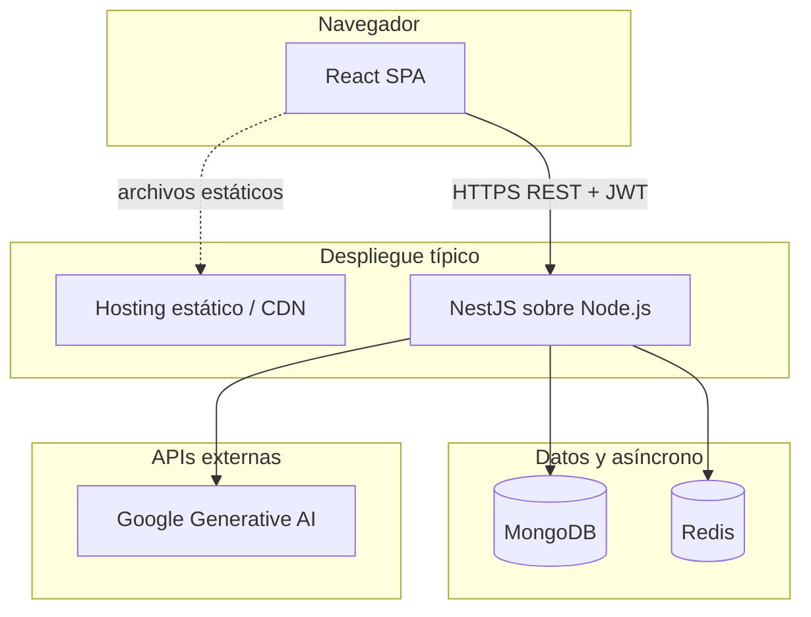

# Nutribiotics — manual técnico

Este documento describe cómo está estructurada la aplicación, en qué **sistemas externos y librerías npm** se apoya y cómo encajan esas piezas en tiempo de ejecución.

Para opciones de despliegue y proveedores de hosting, consulta [DEPLOYMENT.md](DEPLOYMENT.md). Para el estado de seguridad de dependencias, [SECURITY_HARDENING_STATUS.md](SECURITY_HARDENING_STATUS.md).

---

## 1. Propósito (visión general)

Nutribiotics es una **aplicación web** para gestionar **productos nutricionales / suplementos**: catálogo (productos, marcas, ingredientes), **marketplaces**, **inteligencia de precios** (comparaciones e ingesta), **informes** y flujos **asistidos por IA** (por ejemplo, descubrimiento de comparables, marketplaces y comprobaciones de precio usando modelos con herramientas de **Google Search**).

El sistema se divide en:

- Un **frontend de página única (SPA)** servido como archivos estáticos tras el build.
- Una **API backend de ejecución continua** (NestJS) que concentra datos, autenticación, trabajos en segundo plano e integraciones.

---

## 2. Estructura del repositorio

| Ruta | Función |
| ---- | ------- |
| `/` | Proyecto **npm** raíz: ejecuta `concurrently` para levantar frontend + backend en desarrollo (`npm run dev`). |
| `frontend/` | Interfaz **Vite + React + TypeScript**. Salida del build: `frontend/dist/`. |
| `backend/` | API **NestJS 11**. Salida del build: `backend/dist/`. Entrada: `main.ts`. |

Cada una de las tres ubicaciones tiene su propio `package.json` y `package-lock.json` (instalaciones y auditorías independientes).

---

## 3. Arquitectura del sistema



- El **navegador** habla solo con el **backend** para APIs JSON (y, en desarrollo local, opcionalmente con el mismo origen para archivos estáticos).
- **MongoDB** es la fuente de verdad (productos, precios, usuarios, etc.).
- **Redis** respalda las colas de trabajos **BullMQ** y los workers en el mismo proceso Node.
- **Google Generative AI** (mediante el Vercel AI SDK) alimenta las llamadas LLM usadas en flujos de producto/marketplace/precios, a menudo con **Google Search** como herramienta.

---

## 4. Frontend — stack y cómo encaja

### 4.1 Stack en tiempo de ejecución

| Tecnología | Función |
| ---------- | ------- |
| **React 18** | Componentes de UI y composición de páginas. |
| **TypeScript** | Código tipado de la aplicación. |
| **Vite** | Servidor de desarrollo, empaquetado y build de producción (`npm run build` → `dist/`). |
| **React Router** | Rutas del lado del cliente (dashboard, productos, comparaciones, historial, informes, configuración, login). |
| **TanStack Query (`@tanstack/react-query`)** | Caché de estado servidor, refetch y orquestación de peticiones (envuelve llamadas `fetch` propias). |
| **Zustand** | Estado ligero en cliente donde se usa (p. ej. stores de productos). |
| **Tailwind CSS** + **primitivas estilo shadcn/ui (Radix)** | Maquetación, estilos y primitivas accesibles. |
| **React Hook Form** + **Zod** (+ **@hookform/resolvers**) | Formularios y validación. |
| **Sonner** / componentes toast | Notificaciones al usuario. |

### 4.2 Comunicación con el backend

- **URL base:** `import.meta.env.VITE_API_BASE_URL` (reserva `http://localhost:3000` en [`frontend/src/services/api.ts`](frontend/src/services/api.ts)).
- **Autenticación:** token de acceso en `localStorage` bajo `nutrabiotics_access_token`; `authenticatedFetch` añade `Authorization: Bearer <token>` a las peticiones.
- **Forma de la API:** el backend usa un **interceptor de respuesta** global y un **filtro de excepciones**; el frontend normaliza algunas entidades (p. ej. marcas, ingredientes) en `api.ts` para tipos coherentes en la UI.

### 4.3 Entrada y composición

- [`frontend/src/main.tsx`](frontend/src/main.tsx) monta el árbol de React.
- [`frontend/src/App.tsx`](frontend/src/App.tsx) conecta **QueryClientProvider**, **AuthProvider**, **BrowserRouter** y las rutas bajo **MainLayout** (cáscara protegida) frente a **Login**.

---

## 5. Backend — stack y módulos NestJS

### 5.1 Framework y comportamiento transversal

| Tecnología | Función |
| ---------- | ------- |
| **NestJS 11** | Inyección de dependencias modular, controladores, proveedores, ciclo de vida. |
| **Express** (vía `@nestjs/platform-express`) | Adaptador del servidor HTTP. |
| **Mongoose** | Esquemas, modelos y consultas MongoDB. |
| **Passport** + **JWT** (+ estrategia local) | Login y estrategias de access/refresh token ([`auth/auth.module.ts`](backend/src/auth/auth.module.ts)). |
| **class-validator** / **class-transformer** | Validación de DTOs; **ValidationPipe** global (whitelist, prohibir campos no declarados). |
| **ConfigModule** | `.env` → `ConfigService` ([`app.module.ts`](backend/src/app.module.ts)). |
| **BullMQ** + **@nestjs/bullmq** | Colas y workers. |
| **Bull Board** (`/queues`) | UI operativa para inspeccionar colas (adaptador Express). |

Comportamiento tipo middleware en [`backend/src/main.ts`](backend/src/main.ts):

- **CORS** habilitado para todos los orígenes (ajustar en producción según necesidad).
- **TransformInterceptor** y **HttpExceptionFilter** para respuestas y errores de API coherentes.

### 5.2 Módulos de dominio (mapa funcional)

Registrados en [`backend/src/app.module.ts`](backend/src/app.module.ts):

| Módulo | Responsabilidad típica |
| ------ | ---------------------- |
| **UsersModule** | Usuarios; **usuario semilla** al arrancar (`seedDefaultUser`). |
| **AuthModule** | Login, emisión de JWT, estrategias. |
| **ProductsModule** | CRUD de productos y flujos con mucha IA (p. ej. comparables vía `generateText` + modelo Google). |
| **MarketplacesModule** | CRUD de marketplaces y descubrimiento vía LLM + búsqueda. |
| **IngredientsModule** / **BrandsModule** | Catálogos de apoyo. |
| **PricesModule** | Registros de precio ligados a comparaciones / marketplaces. |
| **RecommendationsModule** | Recomendaciones de producto expuestas por API. |
| **IngestionRunsModule** | Seguimiento de ejecuciones de ingesta / comparación. |
| **QueuesModule** | Registro de colas, procesadores, disparadores HTTP para trabajos, **RecommendationService** para IA en workers. |
| **StatsModule** | Estadísticas agregadas para dashboards. |

### 5.3 Trabajos en segundo plano (BullMQ)

Configurados en [`backend/src/queues/queues.module.ts`](backend/src/queues/queues.module.ts):

| Nombre de cola | Propósito (resumen) |
| ---------------- | -------------------- |
| `notifications` | Trabajos tipo notificación (reintentos/backoff configurados). |
| `price-comparison` | Comprobaciones de precio en marketplaces con LLM + herramienta estilo Google Search. |
| `marketplace-discovery` | Descubrir/clasificar marketplaces a partir del contexto de productos. |
| `product-discovery` | Pipeline de descubrimiento del lado producto. |
| `export-comparison` | Trabajos relacionados con exportación (p. ej. salidas de comparación). |

Los workers son **procesadores NestJS `WorkerHost`** en el mismo código; Redis debe ser alcanzable para encolar y ejecutar trabajos.

---

## 6. IA y dependencias HTTP externas

### 6.1 Lo que el código usa hoy

La vía de integración activa en el código es:

- **`ai`** (Vercel AI SDK) — `generateText`, ayudas de salida estructurada.
- **`@ai-sdk/google`** — proveedor Google Generative AI, creado en [`backend/src/providers/googleAiProvider.ts`](backend/src/providers/googleAiProvider.ts) con:

  ```ts
  apiKey: process.env.GOOGLE_GENERATIVE_AI_API_KEY
  ```

Usado desde servicios como:

- [`products/products.service.ts`](backend/src/products/products.service.ts) — comparables / enriquecimiento con modelos **Gemini** y herramienta **google_search**.
- [`marketplaces/marketplaces.service.ts`](backend/src/marketplaces/marketplaces.service.ts) — descubrimiento de marketplaces.
- [`queues/price-comparison.processor.ts`](backend/src/queues/price-comparison.processor.ts) — búsqueda de precios por marketplace.
- [`queues/recommendation.service.ts`](backend/src/queues/recommendation.service.ts) — JSON de recomendación vía Gemini.
- Procesadores de cola bajo `queues/` para flujos de descubrimiento.

> **Nota:** [DEPLOYMENT.md](DEPLOYMENT.md) menciona `GOOGLE_API_KEY`. El backend espera **`GOOGLE_GENERATIVE_AI_API_KEY`** para el proveedor anterior: alinea documentación de entorno y secretos con ese nombre.

### 6.2 Paquetes npm declarados (no necesariamente importados en `src/`)

El `package.json` del backend también lista:

| Paquete | Intención habitual | Nota de uso en el repo |
| ------- | ------------------ | ---------------------- |
| `@ai-sdk/openai` | Modelos OpenAI vía AI SDK | No referenciado bajo `backend/src` en búsqueda de texto; disponible para uso futuro o indirecto. |
| `@ai-sdk/perplexity` | Modelos Perplexity | Igual que arriba. |
| `@browserbasehq/stagehand` | Automatización de navegador / navegador en la nube | Dependencia declarada; **no hay `import` directo bajo `backend/src`** en el momento de escribir esto: puede apoyar scraping planificado o tooling transitivo. Las variables **Browserbase** opcionales en DEPLOYMENT aplican si las activas. |
| `exceljs` | Generación Excel | Declarado; **sin uso encontrado bajo `backend/src`** en el momento de escribir esto: probablemente exportaciones o funciones futuras. |

Trátalos como **marcadores de cadena de suministro y capacidad**: se instalan con la app pero pueden no ejecutarse hasta conectarlos en código.

---

## 7. Servicios externos (dependencias operativas)

| Servicio | ¿Obligatorio? | Uso |
| -------- | ------------- | --- |
| **MongoDB** | Sí | Todos los datos persistentes vía Mongoose (`MONGODB_URI`). |
| **Redis** | Sí | BullMQ (`REDIS_URL` en la configuración de la app). |
| **Google Generative AI** | Sí para funciones IA | Flujos LLM + búsqueda (`GOOGLE_GENERATIVE_AI_API_KEY`). |
| **OpenAI / Perplexity / Browserbase** | Opcional / futuro | Ver tabla de paquetes y [DEPLOYMENT.md](DEPLOYMENT.md). |

---

## 8. Variables de entorno (referencia rápida)

**Frontend** (tiempo de build, `VITE_*`):

- `VITE_API_BASE_URL` — URL pública del backend.
- `VITE_WITH_BACKEND` — estilo feature flag (ver uso en el frontend).

**Backend** (lista completa en [DEPLOYMENT.md](DEPLOYMENT.md)):

- `MONGODB_URI`, `REDIS_URL`
- `JWT_SECRET`, `JWT_REFRESH_SECRET`, `JWT_EXPIRATION`, `JWT_REFRESH_EXPIRATION`
- `SEED_USER_EMAIL`, `SEED_USER_PASSWORD`
- `GOOGLE_GENERATIVE_AI_API_KEY` — **usada por el código** (además de cualquier nombre `GOOGLE_API_KEY` en documentación antigua)
- `PORT` (por defecto `3000`)
- Opcional: `PERPLEXITY_API_KEY`, `BROWSERBASE_*`, claves OpenAI si añades rutas OpenAI después.

---

## 9. Flujo típico de una petición

1. El usuario abre el SPA; **React Router** elige la página.
2. La necesidad de datos dispara **TanStack Query** → llamadas en `api.ts` → **HTTPS** hacia NestJS.
3. El **JWT** (si existe) se envía en cada llamada; los guards del backend exigen autenticación en rutas protegidas.
4. Los manejadores usan **Mongoose** para leer/escribir **MongoDB**.
5. El trabajo largo se **encola en BullMQ** (Redis); los procesadores corren en la misma app Nest, pueden llamar a **Google AI** y persistir en MongoDB.
6. Operaciones pueden inspeccionar colas en **`/queues`** (Bull Board).

---

## 10. Desarrollo local (resumen)

Desde la raíz del repositorio (con Node ≥ 20):

```bash
npm install          # dependencias de ayuda en la raíz
cd frontend && npm ci && cd ..
cd backend && npm ci && cd ..
npm run dev          # concurrently: dev frontend + backend en watch
```

O ejecuta `frontend` y `backend` por separado con `npm run dev:frontend` / `npm run dev:backend`.

---

## 11. Documentos relacionados

| Documento | Contenido |
| --------- | --------- |
| [DEPLOYMENT.md](DEPLOYMENT.md) | Guía de despliegue en español, proveedores, ejemplos de entorno. |
| [SECURITY_HARDENING_STATUS.md](SECURITY_HARDENING_STATUS.md) | Estado actual de auditoría npm, lockfiles, CI, Dependabot. |
| [SECURITY_DEPENDENCY_REPORT.md](SECURITY_DEPENDENCY_REPORT.md) | Informe histórico de dependencias (español). |
| [backend/src/queues/README.md](backend/src/queues/README.md) | Ejemplos de uso de colas y endpoints HTTP. |

---

*Actualiza este manual cuando añadas módulos, colas o integraciones externas.*
